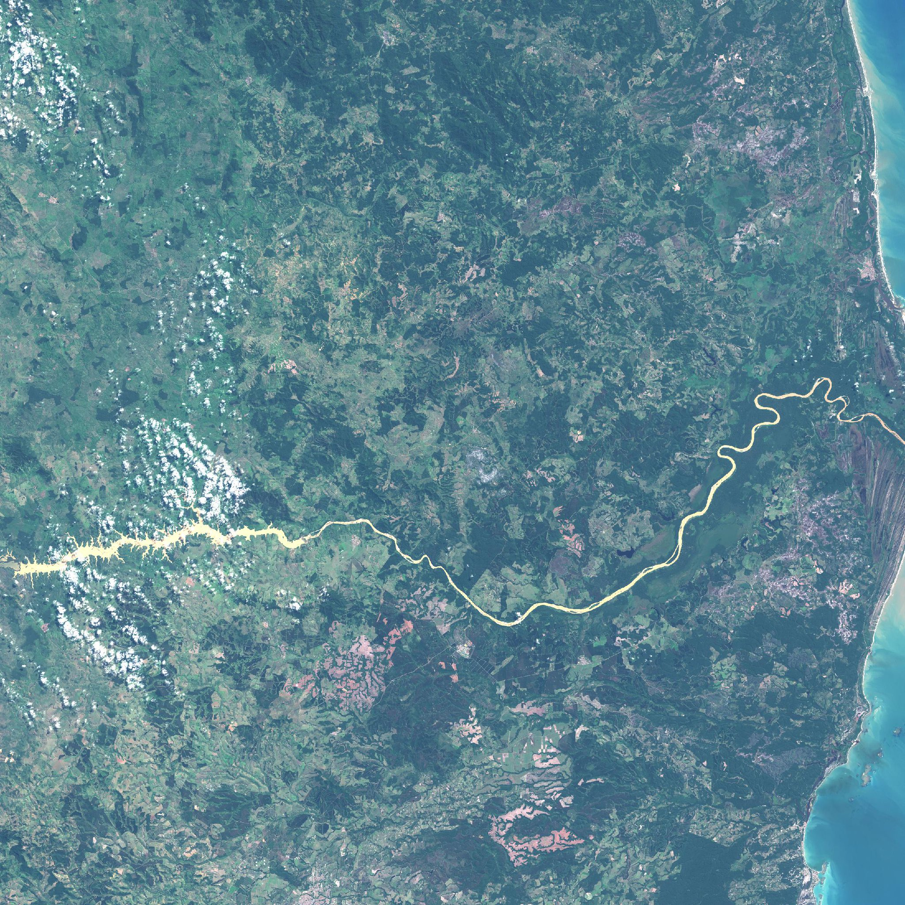

# Sentinel_bot
Code for running sentinel_bot, a twitter account which posts satellite images

This used to grab individual bands from AWS, but I've switched it to grab the tile from scihub since the bucket was switched to requester pays. I've updated much of the logic too!

In your environment you'll need to set your scihub and twitter secrets.

